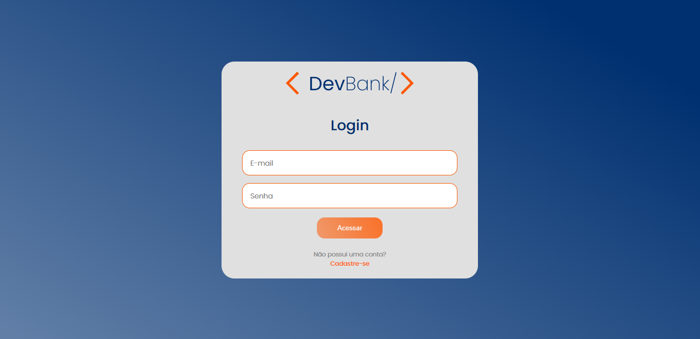
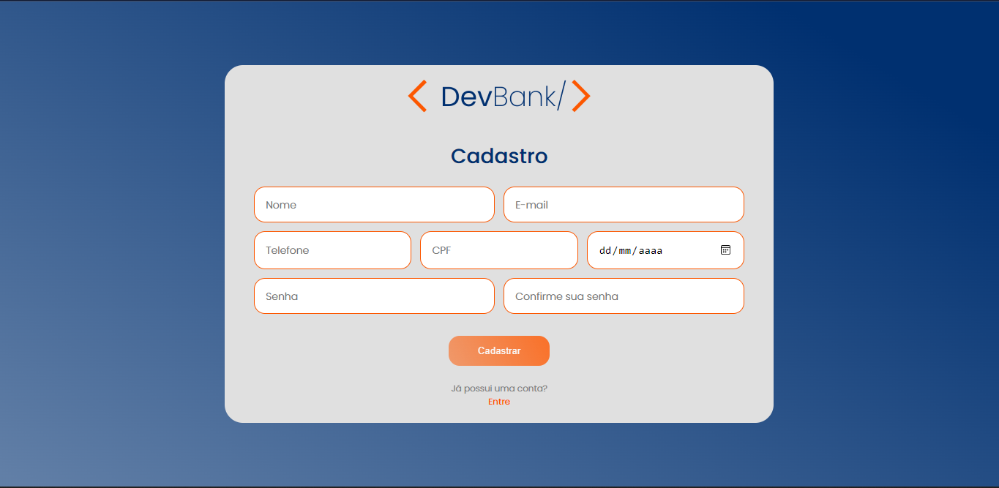
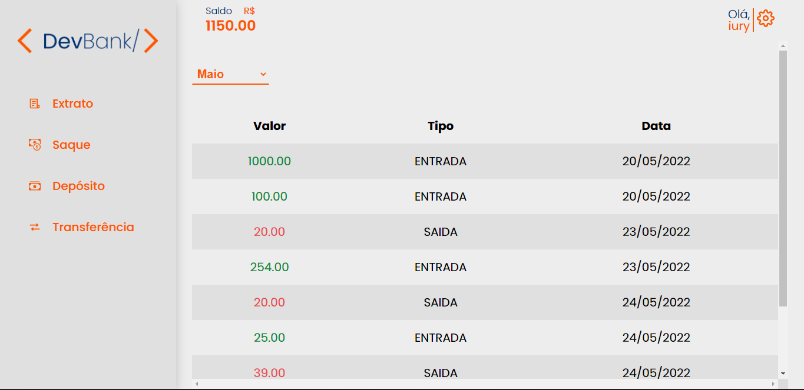

<div align="center"></div>
<br>

<div>





</div>


<h1> Sobre 🔖</h1>

<p>
O projeto devBank foi desenvolvido para o desafio final do programa de formação trade4Devs da TraderMaster com parceria com a plataforma Do Zero ao Um da MaithaTech. Nesse desafio recebemos uma API para consumir, sendo os requisidos: tela de cadastro, tela de login, saldo, extrato e transferência, com remetente e distinatário.
</p>

<br>
<h1> Tecnologias Utilizadas 🚀</h1>

<h3>

 • <a href="https://pt-br.reactjs.org" target="_blank">React</a> <br>
 • <a href="https://www.npmjs.com" target="_blank">NPM</a> <br>
 • <a href="https://axios-http.com/ptbr/docs/intro" target="_blank">Axios</a><br>
 
</h3>

<br>
<h1> Instalação e execução 🔧</h1>

<p> Para fazer a instalação você deve ter o git e npm instalado em sua máquina</p>


<p> 1. Para baixar o projeto siga as instruções abaixo:</p>

```
 git clone https://github.com/iury-assuncao/dev-bank.git
```

<p> 2. Acesse o repositório </p> 

```
 cd dev-bank
```
<p>3. Instale as dependências </p>

```
 npm install
```

<p>4. Inicie o servidor </p>

```
npm start
```

<p> O servidor inciará na porta: 3000 - acesse <a href="http://localhost:3000">http://localhost:3000</a> no seu navegador </p>

<h1> Desenvolvedores ⌨️</h1>

 • <a href="https://github.com/Aguimar-Junior" target="_blank">Aguimar Junior</a> <br>
 • <a href="https://github.com/gustavobiolcatti" target="_blank">Gustavo Biolcatti </a><br>
 • <a href="https://github.com/iury-assuncao" target="_blank">Iury Assunção</a><br>
